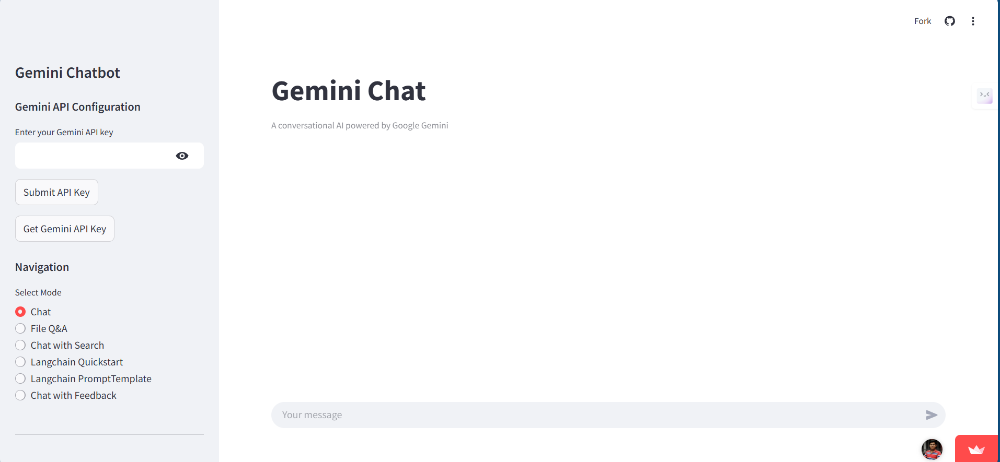
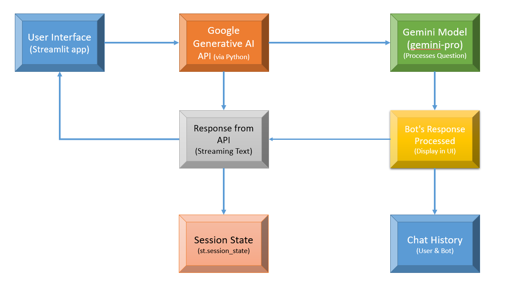

<!-- Header Section -->
    
<h1>Q&A Chatbot System Flow</h1>

Explaining how the chatbot interacts with Google Generative AI API and presents the chat interface using Streamlit.

<!-- Diagram Section -->
<h2>Live Demo>
    https://chatbotgemini-by-shuvankar.streamlit.app/
<h2>System Flow Diagram</h2>

<!-- User Interface Image -->

<h3>1. User Interface (Streamlit Input)</h3>

The user enters a question in the Streamlit app.

<!-- API Integration Image -->
<h3>2. Google Generative AI API Integration</h3>

<a>Not Available </a>

The question is sent to Google Generative AI (Gemini Model) for processing.

<!-- Response and Chat History Image -->
<h3>3. Bot Response and Chat History</h3>

The response is displayed in the chat interface, and the conversation history is maintained.

<!-- How It Works Section -->

<h2>How It Works</h2>

Here's how the chatbot system works in three stages:

<h3>Step 1: User Input</h3>

The user types their question in the Streamlit app’s input box and submits it by pressing the "Ask" button.

<h3>Step 2: API Processing</h3>

The input is sent to the Google Generative AI API (Gemini Model), where the question is processed, and a response is generated.

<h3>Step 3: Response Display</h3>

The generated response is displayed in the chat interface, and the conversation is stored in the chat history using Streamlit's session state.

