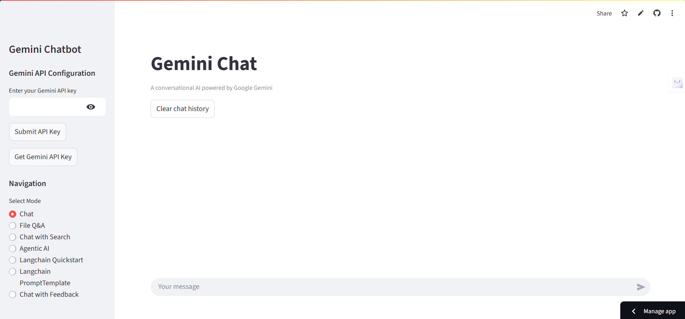

## Gemini Chatbot (with Agentic AI)

A Streamlit app powered by Google Gemini for chat, file Q&A, web-augmented chat, LangChain demos, and a new Agentic AI mode that plans and uses tools (web search, calculator, and persistent notes memory).



## Features

- Chat: regular conversation with Gemini
- File Q&A: ask questions about PDFs, DOCX, images (OCR via Gemini), and text files
- Chat with Search: augment answers with web context
- Agentic AI: planning + tool use
	- Tools: DuckDuckGo web search, calculator, and a simple notes memory (saved to `agent_memory.json`)
	- Step budget control and tool trace viewer
- LangChain Quickstart and Prompt Templates (examples)
- Chat with Feedback (👍/👎 on responses)

## Requirements

- Python 3.10+
- A Google Gemini API key: https://ai.google.dev/

Install dependencies:

```powershell
pip install -r requirement.txt
```

## Run

```powershell
streamlit run Chat_Bot.py
```

In the app sidebar, enter your Gemini API key and submit.

## Modes overview

- Chat: basic Q&A with chat history
- File Q&A: upload a file (pdf, docx, png/jpg, txt) and ask questions about its content
- Chat with Search: lets Gemini leverage the web for fresher answers
- Agentic AI:
	- Toggle tools (Web Search, Calculator, Memory) and set a max step budget
	- Ask tasks like:
		- “Show official links to stream ‘Tujhe Dekha To Yeh Jana Sanam’ and the album/movie details.”
		- “Summarize the song’s singers, composer, movie, year, and 2 lines about its cultural impact.”
		- “What’s 12.5% of 3499, rounded, and store it under key ‘discount’.”
		- “Recall the value of ‘discount’ and craft a sentence using it.”
	- Tool trace can be shown to inspect calls and results
- LangChain Quickstart / Prompt Templates: examples for using Gemini with LangChain
- Chat with Feedback: interact and leave feedback on responses

## Data & privacy

- Web search sends queries to DuckDuckGo. Disable it in Agentic AI if you prefer no external queries.
- Memory is stored locally in `agent_memory.json`.

## Troubleshooting

- Missing package or rename warning (`duckduckgo_search` → `ddgs`):
	```powershell
	pip install ddgs
	```
- PyMuPDF issues on Windows: ensure you’re on a recent Python and run:
	```powershell
	pip install --upgrade pip
	pip install PyMuPDF
	```

If issues persist, share the exact error traceback.

